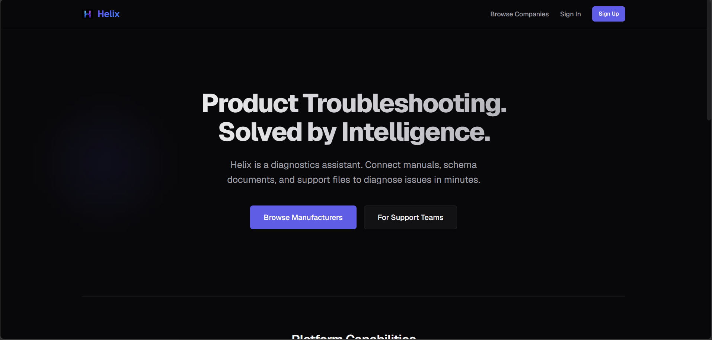
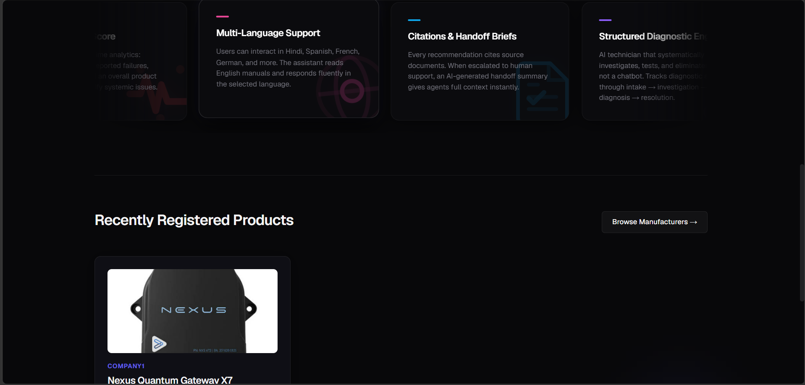
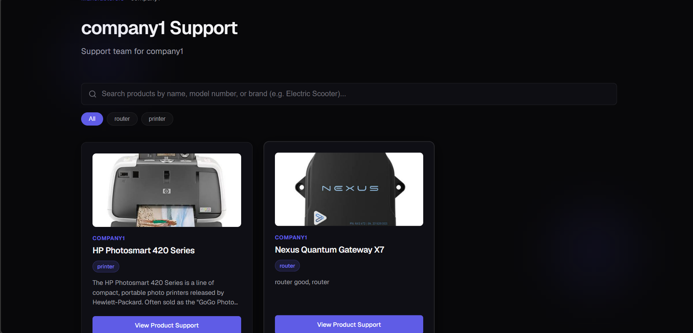
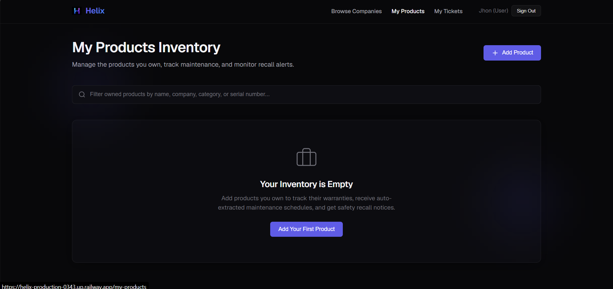

# Helix

> AI-powered product troubleshooting platform built for the PClub × MOSS Hackathon.

Helix helps users diagnose, troubleshoot, and resolve issues with products using official manufacturer documentation. Instead of behaving like a traditional chatbot, Helix follows the workflow of a support technician by investigating symptoms, asking follow-up questions, narrowing down possible causes, and recommending solutions backed by documentation.

---

## Team

### Team Gantz

* Arpit
* Ashutosh Mani Shukla

---
Quick Summary

Helix is an AI-powered product support platform that transforms product documentation into an intelligent diagnostic assistant.

Companies upload manuals, guides, videos, and support resources. Helix indexes this information using MOSS and enables users to troubleshoot issues through a technician-style diagnostic workflow rather than a traditional chatbot interaction.

Core Innovation

Instead of directly answering questions, Helix investigates problems by:

Understanding symptoms
Retrieving relevant documentation
Asking follow-up questions
Eliminating unlikely causes
Recommending corrective actions
Providing source-backed explanations
Built With
Next.js 15
TypeScript
Prisma
SQLite
MOSS
Groq (Llama 3.3 70B)
NextAuth
What Makes Helix Different?

Most support systems focus on answering questions.

Helix focuses on diagnosing problems.

Traditional Support Bot
User Question
      ↓
Retrieve Documents
      ↓
Generate Answer
Helix Workflow
User Reports Symptoms
          ↓
Retrieve Documentation
          ↓
Analyze Context
          ↓
Ask Follow-Up Questions
          ↓
Eliminate Possibilities
          ↓
Perform Diagnostic Reasoning
          ↓
Recommend Corrective Actions
          ↓
Provide Citations

This technician-style workflow helps users identify root causes instead of simply reading documentation.

## Problem Statement

Users interact with hundreds of products every day including routers, printers, washing machines, air conditioners, scooters, water purifiers, and other consumer electronics.

When these products fail, finding the correct solution becomes surprisingly difficult.

Although the required information already exists, it is often scattered across:

* Product manuals
* Support websites
* Knowledge bases
* Technical documentation
* Service guides
* Video tutorials

Users frequently spend hours searching through documentation or contacting support for issues that could be resolved independently.

Current support systems generally suffer from three major limitations:

### Documentation is difficult to navigate

Manuals often contain hundreds of pages of information, making it difficult to locate the exact troubleshooting step required.

### Search systems lack context

Keyword-based searches return large amounts of information without understanding the actual problem being experienced by the user.

### Chatbots answer instead of diagnosing

Most AI assistants retrieve information and immediately provide answers without gathering enough information to determine the real cause of the issue.

---

## Our Solution

Helix converts product documentation into an intelligent support system.

Companies upload product resources such as manuals, technical documentation, videos, and support guides.

The platform processes and indexes these resources using MOSS.

When a user reports an issue, Helix:

1. Retrieves relevant documentation.
2. Understands the reported symptoms.
3. Asks targeted follow-up questions.
4. Eliminates unlikely causes.
5. Suggests safe inspection steps.
6. Determines the most probable root cause.
7. Recommends corrective actions.
8. Provides references to supporting documentation.

This creates a troubleshooting experience closer to speaking with a support engineer than searching through documentation.

---

# Features

## Product Marketplace

The marketplace acts as a centralized catalog where users can discover products and access support resources.

### Company Features

* Create company profiles
* Add products
* Manage product information
* Upload documentation
* Update product resources

### User Features

* Browse products
* Search products
* View product information
* Access support resources
* Start diagnostic sessions

### Search Capabilities

* Product search
* Category filtering
* Company filtering
* Hybrid retrieval using MOSS

---

## Knowledge Repository

Each product has a dedicated knowledge repository.

Supported resource types include:

* PDF Manuals
* Technical Documentation
* Product Guides
* Images
* Videos
* External Documentation Links
* Text Documents

### Processing Pipeline

```text
Upload
   ↓
Parse
   ↓
Chunk
   ↓
Metadata Extraction
   ↓
MOSS Indexing
   ↓
Retrieval Ready
```

The repository becomes the source of truth for all diagnostic recommendations.

---

## Diagnostic Assistant

The diagnostic assistant is the core feature of Helix.

Unlike standard chatbots, the assistant follows a structured troubleshooting process.

### Diagnostic Workflow

```text
User Reports Problem
         ↓
Understand Symptoms
         ↓
Retrieve Documentation
         ↓
Identify Possible Causes
         ↓
Ask Follow-Up Questions
         ↓
Eliminate Possibilities
         ↓
Suggest Tests
         ↓
Evaluate Responses
         ↓
Diagnose Issue
         ↓
Recommend Solution
```

### Example

User:

```text
My scooter horn is not working.
```

Assistant:

```text
Does the headlight work normally?

Is the horn completely silent or weak?

Did the issue start suddenly?

Has any electrical work been performed recently?
```

After collecting sufficient information, the assistant narrows down the issue and recommends the next steps.

---

## Context-Aware Conversations

Helix maintains troubleshooting context throughout the conversation.

The assistant remembers:

* Previous questions
* User responses
* Suggested actions
* Diagnostic progress

This prevents users from repeatedly explaining the same issue.

---

## Documentation Citations

Every recommendation is grounded in manufacturer-provided resources.

Responses include:

* Source document
* Page number
* Relevant section
* Supporting references

This improves transparency and trust.

---

## Session Memory

MOSS sessions are used to maintain diagnostic context.

Benefits:

* Long conversations remain coherent
* Previous troubleshooting steps are remembered
* Follow-up questions become more accurate
* Context is preserved throughout diagnosis

---

## Multi-Language Support

Helix supports multilingual interactions.

Examples:

* English
* Hindi
* Spanish
* French
* German

Users can communicate naturally while still benefiting from the same documentation retrieval system.

---

## Product Ownership & Inventory

Users can maintain a personal inventory of products.

Features include:

* Product ownership tracking
* Warranty monitoring
* Maintenance schedules
* Product history

---

## Maintenance Tracking

Helix can support preventive maintenance workflows.

Examples:

* Filter replacement reminders
* Battery maintenance schedules
* Routine servicing notifications
* Equipment health tracking

---

Implemented Features
User Features
Product search and discovery
Product detail pages
Documentation browsing
Diagnostic assistant
Multi-turn troubleshooting
Context-aware conversations
Source-backed recommendations
Session history
Company Features
Company onboarding
Product management
Documentation uploads
Resource management
Product knowledge base creation
AI Features
Retrieval-Augmented Generation
MOSS-powered retrieval
Session memory
Diagnostic reasoning
Follow-up question generation
Context retention
Documentation grounding
Knowledge Management
PDF ingestion
Text ingestion
External documentation links
Metadata-based retrieval
Product-specific indexing
User Journey
Step 1

User searches for a product.

Step 2

User opens the product page.

Step 3

User starts a diagnostic session.

Step 4

Helix retrieves relevant product documentation.

Step 5

Helix asks follow-up questions.

Step 6

User performs suggested checks.

Step 7

Helix narrows down possible causes.

Step 8

Helix identifies the most probable issue.

Step 9

Helix recommends corrective actions and cites documentation.

Company Journey
Step 1

Company registers on the platform.

Step 2

Company creates product listings.

Step 3

Support resources are uploaded.

Step 4

Documentation is processed and indexed.

Step 5

Knowledge base becomes searchable.

Step 6

Users receive diagnostic assistance powered by company documentation.

# Screenshots

## Landing Page



---

## Product Marketplace



---

## Product Inventory



---

## Company Support Portal



---
What Makes Helix Different?

Most support systems focus on answering questions.

Helix focuses on diagnosing problems.

Traditional Support Bot
User Question
      ↓
Retrieve Documents
      ↓
Generate Answer
Helix Workflow
User Reports Symptoms
          ↓
Retrieve Documentation
          ↓
Analyze Context
          ↓
Ask Follow-Up Questions
          ↓
Eliminate Possibilities
          ↓
Perform Diagnostic Reasoning
          ↓
Recommend Corrective Actions
          ↓
Provide Citations

This technician-style workflow helps users identify root causes instead of simply reading documentation.

# System Architecture

```text
┌───────────────────────────────────────────────────────────────┐
│                           HELIX                              │
└───────────────────────────────────────────────────────────────┘

                        Browser
                          │
                          ▼

                Next.js Frontend
                          │
                          ▼

             Server Actions / APIs
                          │

      ┌───────────────────┼───────────────────┐
      │                   │                   │

      ▼                   ▼                   ▼

 Prisma Database      MOSS Engine        Groq LLM

      │                   │                   │

      └───────────────┬───┴───────────────┬───┘
                      │                   │
                      ▼                   ▼

           Diagnostic Context      Documentation
                Retrieval             Retrieval

                      │
                      ▼

           Diagnostic Assistant
```

---

# MOSS Integration

MOSS is the foundation of the retrieval layer.

Rather than using MOSS as a simple document search engine, Helix uses it across multiple parts of the platform.

---

## Product Discovery

Users searching for products interact with the Product Catalog Index.

```text
User Search
      ↓
Product Catalog Index
      ↓
Relevant Products
```

---

## Product Knowledge Base

Each product receives its own dedicated knowledge base.

```text
Documentation
      ↓
Chunking
      ↓
Indexing
      ↓
Knowledge Base
```

---

## Session Memory

Diagnostic conversations use MOSS sessions.

```text
Conversation
      ↓
Session Storage
      ↓
Context Retrieval
      ↓
Follow-Up Questions
```

---

## Diagnostic Retrieval

```text
User Question
        ↓
Retrieve Relevant Documents
        ↓
Retrieve Session Context
        ↓
Build Diagnostic Prompt
        ↓
Generate Response
        ↓
Store Conversation
```

---

# Technical Implementation

## Frontend

* Next.js 15
* React
* TypeScript
* Responsive Design
* Server Components

---

## Backend

* Next.js API Routes
* Server Actions
* Node.js Runtime

---

## Retrieval Layer

* MOSS SDK
* Product Catalog Index
* Product Knowledge Base
* Session Retrieval

---

## Database

* Prisma ORM
* SQLite

---

## Authentication

* NextAuth
* Role Based Access Control

Roles:

* User
* Company Admin

---

## AI Layer

* Groq SDK
* Llama 3.3 70B

Used for:

* Diagnostic reasoning
* Follow-up generation
* Root cause analysis
* Recommendation generation

---

## Document Processing

Supported formats:

* PDF
* Text
* Links
* Images
* Videos

Processing flow:

```text
Document
    ↓
Parsing
    ↓
Chunking
    ↓
Metadata Extraction
    ↓
Indexing
```

---

# Project Structure

```bash
src/
├── app/
├── actions/
├── components/
├── lib/
├── prisma/
├── types/
└── uploads/

public/
screenshots/
```

---

# Key Engineering Decisions

## Why MOSS?

MOSS was selected because it provides:

* Fast retrieval
* Hybrid search capabilities
* Session memory
* Metadata filtering
* Product-specific indexing

This allowed us to focus on diagnostic reasoning instead of building retrieval infrastructure from scratch.

---

## Why Groq?

Diagnostic conversations require low latency.

Groq provides:

* Fast inference
* Reliable responses
* Strong reasoning capabilities

making it suitable for real-time troubleshooting.

---

## Why Next.js?

Next.js allows:

* Unified frontend and backend
* Server Actions
* API Routes
* Fast development

which is particularly important during a 24-hour hackathon.

---

# Challenges Faced

During development we encountered several challenges:

### Building a diagnostic workflow

Most assistants retrieve information and answer immediately.

Designing a system that investigates problems required a completely different prompting strategy.

### Maintaining context

Diagnostic conversations often span multiple steps.

Ensuring context remained available throughout the conversation was critical.

### Grounding responses

Recommendations needed to remain tied to documentation to avoid hallucinations.

### Document ingestion

Supporting different resource types required a consistent ingestion pipeline.

---

# Future Scope

Planned improvements include:

* Voice-based troubleshooting
* Image-based diagnostics
* Maintenance reminders
* Product ownership dashboard
* Spare part recommendations
* Warranty monitoring
* Recall notifications
* Product analytics
* Service center integration
* Technician handoff workflows

---

Example Diagnostic Session
User

My scooter horn is not working.

Helix

Do the headlights work normally?

User

Yes.

Helix

Is the horn completely silent or weak?

User

Completely silent.

Helix

Has any electrical work been performed recently?

User

No.

Helix

Please inspect Fuse F3 (10A) beneath the front panel.

User

The fuse appears damaged.

Helix

Based on the diagnostic information provided, the most probable cause is a blown horn circuit fuse.

Recommended Action:

Replace Fuse F3 (10A).

Reference:

Service Manual – Section 4.2

Why We Chose This Stack
Next.js
Unified frontend and backend
Server Actions
API Routes
Fast development cycle
MOSS
Retrieval infrastructure
Hybrid search
Session memory
Metadata filtering
Product-specific indexes
Groq
Low latency inference
Fast streaming responses
Strong reasoning performance
Prisma
Type-safe database access
Rapid schema development
Easy migrations
Scalability Considerations

The architecture was designed to remain scalable as the number of products and support resources grows.

Product-Level Isolation

Each product receives its own knowledge index.

Benefits:

Reduced retrieval noise
Better relevance
Faster searches
Session-Based Memory

Conversations maintain context without requiring entire chat histories to be processed repeatedly.

Metadata Filtering

Product, company, and document metadata improve retrieval precision.

Chunked Document Processing

Large documents are split into optimized chunks before indexing to improve retrieval quality.

Development Constraints

This project was built under hackathon constraints.

Constraints
24-hour development window
Small team size
Limited implementation time
Need for meaningful MOSS integration
Approach

Instead of implementing a large number of unfinished features, we focused on:

Product marketplace
Knowledge repository
Diagnostic assistant
Retrieval quality
User experience

to ensure the core workflow was complete and functional.

Roadmap
Phase 1
Product marketplace
Knowledge repository
Diagnostic assistant
MOSS integration
Phase 2
Voice-based troubleshooting
Image diagnostics
Enhanced multilingual support
Phase 3
Maintenance reminders
Product ownership dashboard
Warranty monitoring
Phase 4
Spare parts marketplace
Service center integration
Predictive maintenance
Product analytics

# Local Setup

## Clone Repository

```bash
git clone <repository-url>

cd helix
```

---

## Install Dependencies

```bash
npm install
```

---

## Environment Variables

```env
DATABASE_URL=

NEXTAUTH_SECRET=

MOSS_PROJECT_ID=

MOSS_PROJECT_KEY=

GROQ_API_KEY=
```

---

## Start Development Server

```bash
npm run dev
```

---

# Acknowledgements

Built during the PClub × MOSS Hackathon using:

* MOSS
* Next.js
* Prisma
* Groq
* TypeScript

with the goal of making product troubleshooting more accessible, reliable, and efficient for everyone.
